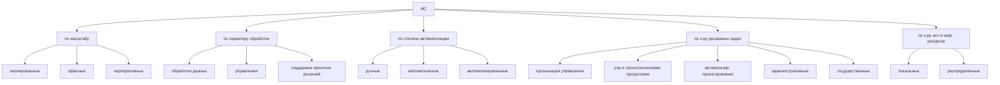

### Информационные системы

ИС - совокупность организационных, программных и технических средств, использующих автоматизированные инф технологиидля поддержки информационных методов управления предоставление управленческому персоналу методов и средств работы с информацией для реализации функций управления

#### Согласно ГОСТ-33707-2016
**ИС** - система предоставляющая организационную обработку информации о предметной области и её хранение
**ИС** представляет из себя совокупность баз данных, в которых содержится информация о предметной области и ресурсах(человеческие, организационные - набор правил использования ИС, программные и аппаратные средства автоматизации), позволяющих хранить и обрабатывать эти данные. 

Конечной задачей ИС является предоставление пользователю необходимых данных, хранящихся в ИС или являющихся результатом обработки данных, хранящихся в ИС.

### Классификация ИС

**Изолированная ИС** - установлена на компьютере, не включённым в локальную сеть, либо инф система не взаимодействует с ресурсами локальной сети
**Офисная ИС** - установлена в локальной сети может использовать выделенный сервер технологии клиент-сервер для связи используются технологии локальной сети
**Корпоративная ИС** - установлена на предприятии, может быть размещена в нескольких зданиях, в том числе в разных городах, такие ИС для объединения на удалённых компьютерах используют либо собственные выделенные линии связи, либо сеть интернет

**Ручные ИС** - в таких системах все операции, связанные с обработкой инф ресурсов, выполняется человеком
**Автоматическая ИС** - в таких системах все операции, связанные с обработкой инф ресурсов, выполняется без участия человека
**Автоматизированные ИС** - в таких системах все операции, связанные с обработкой инф ресурсов, выполняется и человеком, и системой

**Локальные ИС** - инф ресурсы сосредоточены на одном сервере базы данных 
**Распределённые ИС** - функционирует более одного сервера баз данных и они могут быть расположены удалённо 

**ИС организационного управления** - используется для автоматизации функции управленческого персонала, 
**Управление технологическими процессами** - Служат для автоматизации функций производственного персонала, например для автоматизации изготовления микросхем, для поддержания технологического процесса и т.д.
**ИС автоматизированного проектирования** - такие системы предназначены для автоматизации проведения инженерных расчётов< разработки проектной документации и моделирования проектируемых объектов
**Административная ИС** предназначена для руководителя организации и административных работников
**Государственная ИС** - обеспечивает обмен информацией между государственными органами для реализации их полномочий

### Свойства информационных систем

	1 Структура - множество элементов информационной системы и взаимосвязей между ними
	2 Входы и Выходы - потоки сообщений поступающие в ИС и выходящие из неё
	3 Закон поведения информационной системы - функция связывающая входы и выходы ИС
	4 Цель и ограничения на функционирование ИС - 

#### Свойства:
* **Сложность** - Множество входящих в ИС компонентов, изменяющих внутренние и внешние связи компонентов
* **Делимость** - состоит из подсистем, выделенных по определённому признаку и отвечающих конкретным целям и задачам
* **Целостность** - Означает, что функционирование множества элементов ИС подчинено единой цели
* **Структурированность** - предполагает распределение элементов ИС по иерархии

Создание  и функционирование ИС основываются на следующих принципах:
	1)Системность - позволяет чётко определить цели создания ИС и общие свойства присущие системе как единому целому
	2)Модульность - предусматривает построение ИС в виде взаимосвязанных и взаимодополняемых модулей, замена одного модуля другим не нарушает целостность системы
	3)Адаптируемость/Гибкость - обеспечивает приспособление системы к новым условиям функционирования при сохранении её работоспособности 
	4)Стандартизация и унификация - для проектирования ИС следует использовать типовые решения в разумной мере 

### Архитектура ИС

Автоматизированная ИС - организационно-упорядоченная совокупность документов и ИТ, с использованием средств вычислительной техники и связи, реализующих информационные процессы

В состав автоматизированной ИС входят следующие подсистемы:
- Аппаратное обеспечение 
	- Телекоммуникационное и сетевое оборудование
	- Компьютерное оборудование
	- Периферия и средства орг техники
	- Устройство бесперебойного питания
- Программное обеспечение
	- Системное ПО
	- Прикладные программы
	- Офисные пакеты
	- Инструментально ПО (средства программирование и отладки)
	- Диагностическое ПО (антивирусные пакеты программ)
- Математическое обеспечение 
	- Совокупность математических методов, моделей и алгоритмов
	- Средства математического обеспечения (типовые задачи, средства моделирования, методы математического программирования, методы математической статистики, методы теории массового обслуживания и т.д. )
- Информационное обеспечение
	- Унифицированной системной документации
	- Информационная база
	- Единая система классификации
- Организационное обеспечение
	- Совокупность мероприятий, регламентирующих функционирование и использование технического программного или информационного обеспечения и определяющих порядок выполнения действий приводящих к искомому результату
- Правовое обеспечение 
	- Совокупность норм, выраженных в нормативных актах, устанавливающих и закрепляющих организацию ИС, их цели, задачи, структуру, функции и правовой статус
